 

## 🧠 About

I'm a Computer Science & Engineering undergraduate at the **Institute of Engineering and Management, Kolkata**, working at the intersection of AI/ML, full-stack development, and computational research. I like turning ambiguous problems into working systems — a chatbot-driven payroll platform, a personal AI assistant, or a numerical solver for fluid flow — with equal weight on precision and purpose.

<table width="100%">
<tr>
<td width="33%" align="center">🎓 <b>Education</b> B.Tech, CSE</td>
<td width="33%" align="center">🏫 <b>Institute</b> IEM, Kolkata</td>
<td width="33%" align="center">📊 <b>CGPA</b> 9.55 (current)</td>
</tr>
<tr>
<td width="33%" align="center">📍 <b>Location</b> Kolkata, India</td>
<td width="33%" align="center">🔬 <b>Research</b> Computational Fluid Dynamics</td>
<td width="33%" align="center">🤖 <b>Focus</b> AI / ML + Software Dev</td>
</tr>
</table>

## ⚡ Currently

| | | |
|---|---|---|
| 🤖 **J.A.R.V.I.S**   Personalized AI assistant | 🧪 **CFD Research**   Backward-facing-step channel, Fortran solver | 🌱 **Learning**   DSA · Applied ML · Web Development |
| `● ONGOING` | `● IN PROGRESS` | `● ACTIVE` |

## 🛠️ Tech Stack

`Languages` &nbsp;
  
`Web` &nbsp;
  
`Tools` &nbsp;
  

## 🚀 Featured Projects

| Project | Description | Tech | Status |
|---|---|---|---|
| 🤖 **J.A.R.V.I.S** | Personalized AI assistant inspired by intelligent automation | `Python` `AI` | `ONGOING` |
| 💼 **AI-Powered Payroll Management System** | Payroll management system with an integrated AI chatbot for employee assistance | `Python` `AI` | `COMPLETED` |
| ⏰ **Time Management Web App** | Productivity and task management web application | `Web` | `COMPLETED` |
| 🛒 **Smart Retail Shelf Analytics** | Analytics system for retail shelf monitoring | `Python` `Data` | `ONGOING` |

*Repository links will be added here once the individual project repos are public.*

## 🔬 Research Lab

**Publications**

| Title | Status |
|---|---|
| An Overview of Convective Flow of Nanofluids in a Backward-Facing Step Channel: A Numerical Approach | `IN PROGRESS` |
| ECHO — Efficient Conflict-aware Handoff & Orchestration | `IN PROGRESS` |

## 💼 Experience

<table width="100%">
<tr><td><b>Full Stack Web Development Intern</b> — ElevanceSkills Jun 2026 – Jul 2026</td></tr>
<tr><td>Industry-oriented full-stack training; built a real-time web app with Spring Boot (Java); worked across frontend, backend, REST APIs, and database integration.</td></tr>
<tr><td><b>Web Development Intern</b> — 1stop.ai, KSHITIJ IIT Kharagpur Feb 2026 – Apr 2026</td></tr>
<tr><td>Designed and developed responsive web applications; applied frontend/backend concepts across practical assignments.</td></tr>
<tr><td><b>International Study Abroad Programme</b> — Asian Institute of Technology, Thailand Jun 2026 – Jul 2026</td></tr>
<tr><td>Programme on cybersecurity and AI data analytics; collaborated with international faculty and students.</td></tr>
</table>

## 🎓 Education

**B.Tech, Computer Science & Engineering** — Institute of Engineering and Management, Kolkata
 Aug 2024 – Present · CGPA: 9.55 (current)

Class 12 (Science) — 91% &nbsp;·&nbsp; Class 10 — 89.14%

## 📜 Certifications

- Full Stack Web Development Training — ElevanceSkills (2026)
- Web Development Internship — 1stop.ai, KSHITIJ IIT Kharagpur (2026)
- Web Development Training Programme — 1stop.ai, KSHITIJ IIT Kharagpur (2025–2026)
- International Study Abroad Programme on Cybersecurity and AI Data Analytics — AIT, Thailand (2026)
- Programming in Java — NPTEL
- The Joy of Computing Using Python — NPTEL
- Introduction to Machine Learning — NPTEL
- What is Data Science — Coursera

## 🏆 Achievements & Hackathons

🏆 **7th Rank Holder**, Department of Computer Science & Engineering, UEM Kolkata

🎯 DevSprint 2025 — ACM Student Chapter, UEM Kolkata
 🎯 Minecraft Technical Event 2025 — ACM Student Chapter, UEM Kolkata

## 📊 GitHub Stats & Graphs

Dynamically generated by third-party services — if a card doesn't render on first load, it's an upstream availability issue, not a broken link.

## 🗓️ Contribution Graph

## 🐍 Watch the Snake Eat My Contributions

<picture>
  <source media="(prefers-color-scheme: dark)" srcset="https://raw.githubusercontent.com/jeetsaha1/jeetsaha1/output/github-snake-dark.svg">
  <source media="(prefers-color-scheme: light)" srcset="https://raw.githubusercontent.com/jeetsaha1/jeetsaha1/output/github-snake.svg">
  
</picture>

## 📡 Let's Connect

 

